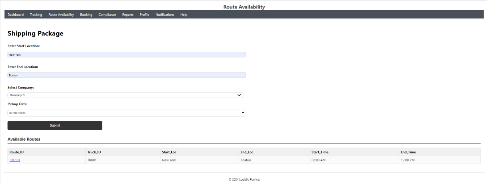
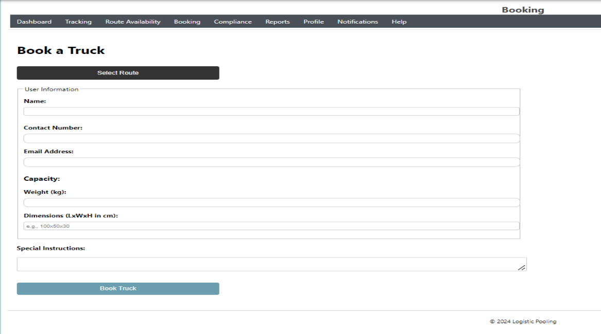
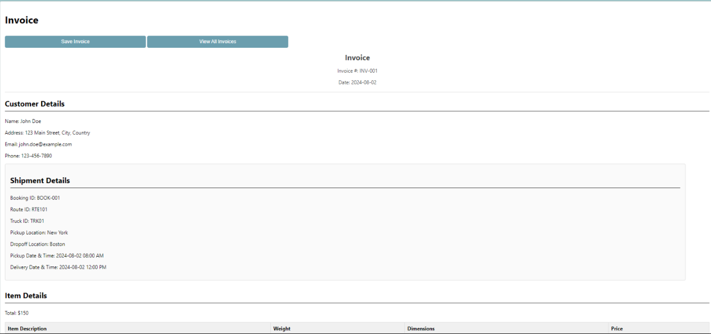

# Logistics Pooling Optimization Platform
Website Creation: 

The Logistics Pooling Platform is designed to optimize freight transportation by leveraging advanced web technologies. It integrates real-time data analysis, machine learning algorithms, and IoT to enhance visibility, route optimization, and regulatory compliance. As the frontend developer, my primary responsibility was to create a dynamic and user-friendly interface that streamlines logistics operations and improves user experience.

## Features
- **Login/Signup Page:** Secure user authentication with options for password recovery.
- **Dashboard:** Central hub displaying shipment status, fleet utilization, and compliance metrics.
- **Real-time Tracking:** Interactive map for monitoring shipment locations and statuses.
- **Route Availability:** Input shipment details and view available routes.
- **Booking System:** Reserve trucks with an easy-to-use booking form.
- **Compliance Management:** Tools and information for regulatory adherence.
- **Reports & Analytics:** Data visualizations for performance and operational insights.
- **User Profile Management:** View and update personal information.
- **Notifications & Alerts:** Keep users informed about critical events.
- **Help/Support:** FAQs and contact forms for user assistance.

## Tech Stack
- **HTML5:** Structuring the content.
- **CSS3:** Styling and responsive design.
- **JavaScript:** Adding interactivity and seamless user actions.
- **React.js:** Component-based architecture for state management and reusability.
- **Version Control:** Git for collaboration and tracking changes.
- **Testing:** Firefox Developer Edition for cross-browser compatibility.

## Website Creation: 

This is the for Route availability. 

### Step 1: 

Once you enter the details and click submit it will display the list of available routes and trucks details.  

Then will click on the selected Route_ID.  

### Step 2: 

By Clicking on Route_ID it will redirect to Booking page to book a truck

After entering the details and click Book Truck. It will book the details and will generate the invoice.

### Step 3: 

Generated Invoice You can download.

